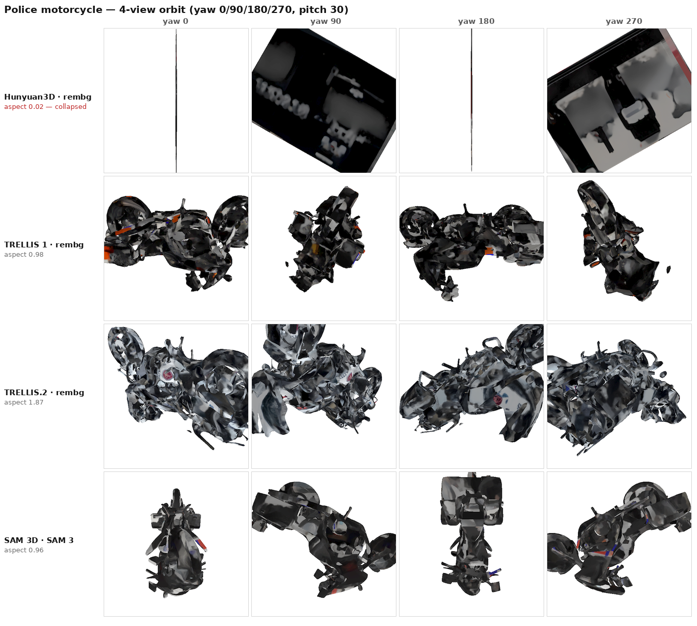

# HTX-3D image-to-3D evaluation — final results

**7 pipelines × 10 HTX objects · RTX 5090 · 2026-07-31**

Pipelines are 4 engines × 2 segmentation front-ends (SAM 3D runs only with SAM 3):
`rembg` = raw photograph, engine removes the background itself; `SAM 3` = SAM 3
cutout fed to the engine.

---

## 1 · Conclusions

**Scope.** Four multi-object APICS scenes are excluded from all results below.
Two criteria, both independent of outcome: background removal cannot isolate the
intended target in those photographs, so the measurement reflects segmentation
failure rather than engine quality; and their ground truth is estimated rather
than published. This leaves **10 objects**, 6 with manufacturer specifications.

**1. Hunyuan3D with rembg is the weakest pipeline.** The claim rests on mesh
integrity, not on dimensional significance, and three measurements agree:

- **3× worse proportion accuracy** than every other pipeline — mean |log aspect
  error| 0.85 against 0.30–0.40 (§3.3)
- 3 of 10 objects reconstructed >2× too flat (§3.3)
- the only pipeline producing collapsed geometry — the police motorcycle under
  both segmentation modes, caught independently by silhouette coverage (§3.4).
  The motorcycle has published dimensions, so this does not depend on any
  estimated ground truth.
- highest dimensional error (35.2% vs 23.5–29.1%), though not significantly so

**2. No pipeline pair separates on dimensional accuracy.** A paired Wilcoxon
across all 21 pairs finds nothing at p<0.05 on the 10 reported objects. Auto-scale's
own error on these objects is ~25%, comparable to the spread between engines, so
this axis measures the instrument as much as the pipelines. Engine selection must
rest on the other axes.

> With the APICS scenes included (n=14), two pairs did reach p<0.05, both against
> Hunyuan·rembg — because that is where it fails hardest. Excluding them removes
> that evidence but tightens every interval. Both readings are reported here
> rather than choosing the more flattering one.

**3. They fail differently, and no single number captures it:**

| | TRELLIS 1 | TRELLIS.2 | SAM 3D |
|---|---|---|---|
| Speed | **10 s — fastest** | 24 s | 20 s |
| Dimensional error (10 objects) | 26.1% | 25.6% | **23.5%** |
| Mesh cleanliness | 9 components | 185 components — most fragmented | **5 components — cleanest** |
| Open boundaries | 3.4 loops | 11.0 loops | **1.6 loops** |
| Texture uniformity around the object | 0.64 | **0.78 — most even** | 0.68 |

**4. Segmentation is the binding constraint on cluttered scenes.** This is why
the APICS photographs were excluded rather than reported: `rembg` hands the engine
the whole scene instead of the target, producing 90–141% dimensional errors that
say nothing about the engine. Any deployment on multi-object imagery needs SAM 3
segmentation in front of the engine.

### Recommendation by use case

| Need | Pipeline |
|---|---|
| Throughput / interactive turnaround | **TRELLIS 1 · rembg** — 10 s, dimensionally best-in-class |
| Assets needing least manual repair | **SAM 3D · SAM 3** — cleanest topology by a wide margin |
| Maximum surface detail, cleanup acceptable | **TRELLIS.2** — most detail and most even texture, but most fragmented |
| Cluttered / multi-object source photos | any engine, but **with SAM 3 segmentation** |
| — | **Not Hunyuan3D · rembg** |

---

## 2 · Metric set

The governing constraint: **no ground-truth 3D meshes exist for these objects**,
so Chamfer distance, F-score, voxel-IoU and EMD — the standard geometric metrics
in the image-to-3D literature — are unavailable. What we do have ground truth for
is **real-world dimensions** from manufacturer and standard specifications.

| Track | Metric | Status |
|---|---|---|
| Dimensional accuracy | MAPE vs. spec sheets, bootstrap CIs, paired Wilcoxon | ✅ lead result |
| Performance | gen time, peak VRAM, faces, file size | ✅ |
| Mesh integrity | components, floater fraction, boundary loops, aspect vs. spec | ✅ new |
| Multi-view | silhouette coverage (collapse), texture one-sidedness | ✅ new |
| Perceptual | blinded human scoring, geometry + texture 1–5 | ⏳ pending |

### Metrics dropped, and why

- **SSIM, PSNR, LPIPS-vs-photograph.** Measured at SSIM 0.24 / PSNR 6.4 dB /
  LPIPS 0.78, essentially uniform across all conditions. PSNR 6.4 dB implies
  RMSE ≈ 120 on a 0–255 scale — the images are near-unrelated. The cause is
  protocol, not reconstruction: a canonical render on flat grey was being
  compared against a real photograph with its own background, framing and camera
  pose. The between-condition spread was smaller than the within-condition spread
  across objects, so they carried no discriminative power. LPIPS remains a
  legitimate metric but requires aligned renders, which needs GT meshes.
- **watertight %.** Constant at 0.0% for all conditions — zero information.
  Replaced by boundary-loop count, which ranges 0.0 to 16.1.
- **Opposite-view CLIP similarity (janus/duplicate-front proxy).** Negative
  result: mean 0.918–0.936 across all seven pipelines, spread 0.018. On a white
  background CLIP similarity is dominated by silhouette and background rather
  than by texture duplication. Reported here so it is not re-attempted the same
  way; detecting duplicated fronts needs a different approach.

---

## 3 · Results

### 3.1 Dimensional accuracy

Mean absolute percentage error on the object's longest real-world dimension.
"High-conf" = the 6 objects with manufacturer or published-standard dimensions.
Paired bootstrap 95% CIs, resampling objects, 20k draws.

| Pipeline | MAPE (10) | 95% CI | MAPE (high-conf, n=6) | within ±20% |
|---|---:|:---:|---:|---:|
| SAM 3D · SAM 3 | **23.5%** | [14.9, 33.5] | **19.4%** | **60%** |
| TRELLIS.2 · rembg | 25.6% | [17.7, 34.3] | 24.6% | 40% |
| TRELLIS 1 · rembg | 26.1% | [19.0, 35.2] | 19.5% | 50% |
| TRELLIS 1 · SAM 3 | 27.0% | [20.3, 35.3] | 21.4% | 40% |
| Hunyuan3D · SAM 3 | 28.2% | [19.0, 39.1] | 27.6% | 30% |
| TRELLIS.2 · SAM 3 | 29.1% | [22.4, 36.9] | 27.7% | 30% |
| Hunyuan3D · rembg | 35.2% | [22.0, 49.4] | 35.1% | 30% |

Paired Wilcoxon signed-rank across all 21 pipeline pairs finds **no significant
difference at p<0.05**. The ordering above is real but not statistically
supported, and should not be presented as a ranking.

Auto-scale's own error on these objects is ~25% (§5 of the auto-scale ablation),
which is the same magnitude as the spread between pipelines. That is the most
likely reason nothing separates: the instrument is as noisy as the effect.

98/98 auto-scale runs succeeded overall (70/70 among the reported objects) — no
silent failures.

### 3.2 Performance

| Pipeline | Mean gen time | Peak VRAM | Mean faces |
|---|---:|---:|---:|
| TRELLIS 1 | 10.4 s | — | 21.5k |
| SAM 3D | 19.7 s | — | 17.1k |
| TRELLIS.2 | 24 s (18.8 gen + 5.6 export) | 7.8 / 32 GB | ~50k |
| Hunyuan3D | 74.9 s | — | 38.4k (40k cap) |

Hunyuan3D is 4–7× slower than the alternatives. TRELLIS.2 was exported at
texture 1024 / ~50k faces for parity; it natively supports 4K / 1M faces.

### 3.3 Mesh integrity

Computed from the GLBs alone, no ground truth and no renders. Vertices are welded
first — these GLBs carry per-face vertex copies for UVs, and without welding the
face-adjacency graph is meaningless.

`aspect_ratio` = predicted (shortest ÷ longest axis) ÷ true proportions from the
spec sheet. 1.00 = correct; 0.02 = 50× flatter than the real object. Axes are
sorted, so this is **orientation-independent** and unaffected by camera pose.

| Pipeline | components | floater face frac | boundary loops | aspect_ratio (med) | mean \|log err\| | >2× too flat |
|---|---:|---:|---:|---:|---:|---:|
| SAM 3D · SAM 3 | **5.4** | 0.048 | **1.6** | 1.33 | 0.31 | 0/10 |
| TRELLIS 1 · SAM 3 | 9.7 | 0.058 | 2.9 | 1.21 | **0.30** | 0/10 |
| TRELLIS 1 · rembg | 9.4 | 0.073 | 3.4 | 1.20 | 0.34 | 0/10 |
| Hunyuan3D · SAM 3 | 12.3 | 0.101 | 0.0 | 1.03 | 0.60 | 1/10 |
| Hunyuan3D · rembg | 16.3 | 0.044 | 0.0 | 0.90 | **0.85** | **3/10** |
| TRELLIS.2 · SAM 3 | 189.6 | 0.073 | 7.4 | 1.42 | 0.36 | 0/10 |
| TRELLIS.2 · rembg | 184.9 | 0.118 | 11.0 | 1.44 | 0.40 | 0/10 |

**This is where the Hunyuan finding rests.** Proportion accuracy is objective,
spec-anchored and orientation-independent, and Hunyuan·rembg is roughly 3× worse
than every other pipeline on it. Unlike the dimensional MAPE, this does not pass
through auto-scale's monocular-depth estimate.

Most collapsed reconstructions among the reported objects:

| aspect_ratio | Object | Pipeline |
|---:|---|---|
| 0.01 | Police motorcycle | Hunyuan3D · SAM 3 |
| 0.02 | Police motorcycle | Hunyuan3D · rembg |
| 0.35 | Security guard house | Hunyuan3D · rembg |
| 0.41 | Police patrol car | Hunyuan3D · rembg |

All four are Hunyuan. The motorcycle has published manufacturer dimensions, so
the two worst cases do not rely on estimated ground truth.

A systematic effect across all pipelines: genuinely slender objects are
over-thickened. The coast-guard boat (true aspect 0.17) comes out 1.7–2.7× too
fat in every pipeline.

### 3.4 Multi-view findings

98 models re-rendered at yaw {0°, 90°, 180°, 270°}, pitch 30° — the protocol
published in the TRELLIS paper. This replaces the earlier single fixed-camera
render, which showed a different side of the object per pipeline because no
pipeline emits a canonical orientation.

**Collapsed geometry, detected independently.** A flat sheet is a hairline from
two opposite yaws. Among the 10 reported objects, the police motorcycle falls
below 1% silhouette coverage under **both** Hunyuan modes and under no other
pipeline — the same failure the aspect-ratio metric flagged, found by an unrelated
method. (Two further collapses occur on the excluded APICS scenes, also Hunyuan.)



**Texture one-sidedness** (min ÷ max colour saturation inside the silhouette
across views; 1.0 = uniform all round): TRELLIS.2 · SAM 3 0.84 · TRELLIS.2 ·
rembg 0.78 · Hunyuan3D · SAM 3 0.74 · Hunyuan3D · rembg 0.73 · TRELLIS 1 · SAM 3
0.72 · SAM 3D 0.68 · TRELLIS 1 · rembg 0.64. This corroborates the earlier qualitative claim that TRELLIS.2
transfers texture most evenly and SAM 3D carries the least surface detail. Caveat:
the measure cannot distinguish a one-sided texture from an object whose sides are
genuinely different colours.

---

## 4 · Limitations

- **No ground-truth meshes**, so no Chamfer distance, F-score, voxel-IoU or EMD.
  Geometry is assessed indirectly via dimensional accuracy and mesh integrity.
  The fix is to run the same pipelines on a GT-mesh dataset (Google Scanned
  Objects) for literature-comparable numbers.
- **n=10, single seed, no repeats.** Confidence intervals are wide and
  generative 3D models have real seed-to-seed variance that is not captured. The
  high-confidence dimensional column rests on **6 objects**.
- **Four APICS scenes excluded** on the two criteria stated in §1. Excluding them
  tightens every interval but also removes the only pairs that had reached
  p<0.05 — both readings are given rather than the more favourable one.
- **Auto-scale is the accuracy bottleneck.** It estimates size from a single
  photograph via monocular depth; even the best pipeline sits near 20% MAPE. That
  is a depth-estimation limit, not a mesh-quality limit.
- **Perceptual quality is not yet measured.** The blinded human scoring pass is
  built and pending (§5).

## 5 · Not yet done

1. **Blinded human scoring** — harness complete, 0/98 scored. Needs ~45 min of a
   human rater; defect flags are now automated so only the two 1–5 scores remain.
2. **Uni3D-I / ULIP-I** — needs no GT mesh and is the only metric family shared by
   Hunyuan 2.1, SAM 3D and Step1X, so it buys comparability with published
   tables. Do not expect it to separate these seven: SAM 3D's own paper reports
   0.3707 vs 0.3698 across genuinely different methods.
3. **GSO subset** for Chamfer / F-score.
4. **TRELLIS.2 paper** (arXiv 2512.14692) not yet in `references/`.

## 6 · Reproducing

```bash
# dimensional accuracy (host)
cd evaluation/auto_scale_benchmark && python3 benchmark_auto_scale.py

# mesh integrity — needs trimesh
~/miniconda3/envs/3D/bin/python evaluation/benchmark_v2/mesh_defect_metrics.py

# 4-view orbit renders + multi-view metrics — need nvdiffrast + CLIP, in-container
docker exec htx-3d python /app/gallery/_orbit_render.py
docker exec htx-3d python /app/gallery/_orbit_metrics.py

# blinded scoring / live comparison UI
cd evaluation/manual_eval && ./serve.sh
```

Data: `trellis2_benchmark/results.csv` (dimensional) ·
`benchmark_v2/mesh_defects.csv` (integrity) · `benchmark_v2/orbit_defects.csv`
(multi-view) · `benchmark_v2/metrics_table.md` (performance).
