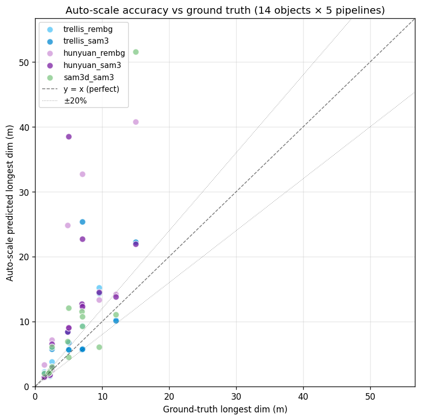
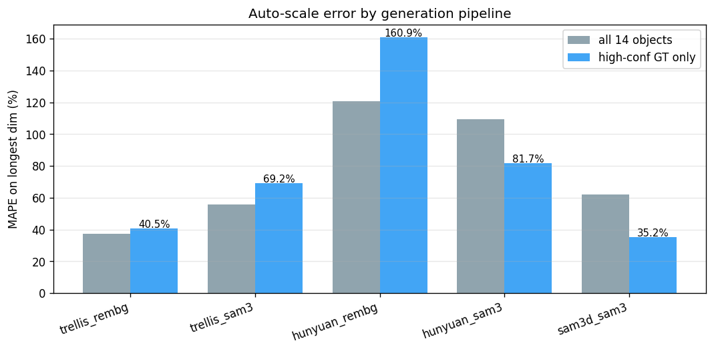
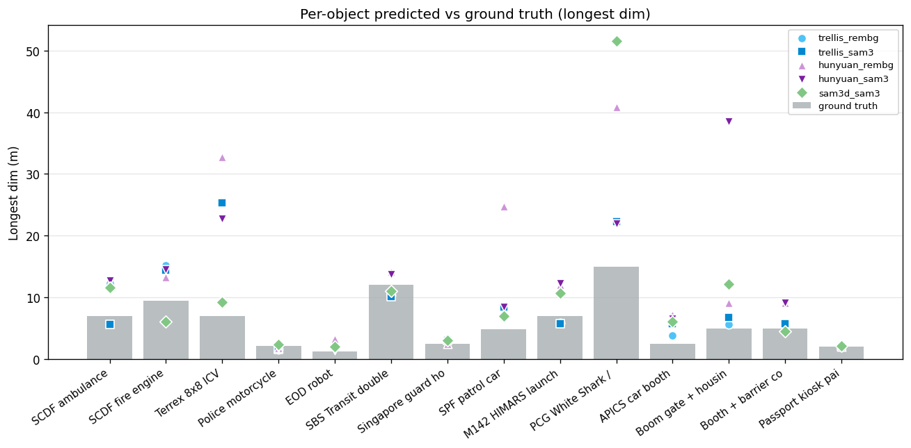

# Auto-scale benchmark — 14 HTX objects × 5 pipelines

Generated: 2026-06-05 06:22

## Headline

- **High-confidence ground truth (n=30 rows)**: longest-dim MAPE = **77.5%**, median error 38.4%, mean view-IoU 0.72
- **All ground truth (n=70 rows)**: longest-dim MAPE = 77.0%, 34% of predictions within ±20% of GT, 53% within ±50%

("high-confidence GT" = objects with manufacturer-published or standard-spec dimensions — Mercedes Sprinter, Terrex, Volvo bus, Hyundai sedan, HIMARS, standard police bike.)

## Per-pipeline accuracy

| Pipeline | n | MAPE longest (all) | MAPE longest (high-GT) | mean IoU | within ±20% | within ±50% |
|---|---:|---:|---:|---:|---:|---:|
| trellis_rembg | 14 | 37.3% | 40.5% | 0.71 | 36% | 64% |
| trellis_sam3 | 14 | 55.5% | 69.2% | 0.69 | 43% | 64% |
| hunyuan_rembg | 14 | 120.6% | 160.9% | 0.70 | 29% | 36% |
| hunyuan_sam3 | 14 | 109.3% | 81.7% | 0.68 | 36% | 43% |
| sam3d_sam3 | 14 | 62.0% | 35.2% | 0.71 | 29% | 57% |

## Per-object detail (all pipelines)

| Object | GT longest (m) | GT conf | Pipeline | Pred longest (m) | err % | IoU | conf |
|---|---:|:---:|---|---:|---:|---:|:---:|
| SCDF ambulance (Mercedes Sprinter chassis) | 6.94 | high | hunyuan_rembg | 12.29 | 77.2% | 0.77 | high |
|  |  |  | hunyuan_sam3 | 12.69 | 82.8% | 0.76 | high |
|  |  |  | sam3d_sam3 | 11.58 | 66.9% | 0.76 | high |
|  |  |  | trellis_rembg | 12.25 | 76.5% | 0.74 | high |
|  |  |  | trellis_sam3 | 5.65 | 18.6% | 0.68 | high |
| SCDF fire engine (Scania P-series pumper) | 9.50 | medium | hunyuan_rembg | 13.34 | 40.4% | 0.79 | high |
|  |  |  | hunyuan_sam3 | 14.51 | 52.8% | 0.81 | high |
|  |  |  | sam3d_sam3 | 6.07 | 36.2% | 0.81 | high |
|  |  |  | trellis_rembg | 15.23 | 60.3% | 0.78 | high |
|  |  |  | trellis_sam3 | 14.38 | 51.4% | 0.78 | high |
| Terrex 8x8 ICV | 7.00 | high | hunyuan_rembg | 32.76 | 368.0% | 0.75 | high |
|  |  |  | hunyuan_sam3 | 22.75 | 225.0% | 0.73 | high |
|  |  |  | sam3d_sam3 | 9.27 | 32.5% | 0.75 | high |
|  |  |  | trellis_rembg | 9.37 | 33.9% | 0.64 | high |
|  |  |  | trellis_sam3 | 25.36 | 262.3% | 0.74 | high |
| Police motorcycle (Yamaha/BMW class) | 2.20 | high | hunyuan_rembg | 1.81 | 17.9% | 0.56 | high |
|  |  |  | hunyuan_sam3 | 1.81 | 17.7% | 0.56 | high |
|  |  |  | sam3d_sam3 | 2.37 | 7.6% | 0.54 | high |
|  |  |  | trellis_rembg | 1.58 | 28.2% | 0.60 | high |
|  |  |  | trellis_sam3 | 1.59 | 27.8% | 0.57 | high |
| EOD robot (Caliber/Andros class) | 1.30 | medium | hunyuan_rembg | 3.30 | 153.8% | 0.52 | high |
|  |  |  | hunyuan_sam3 | 1.42 | 9.5% | 0.55 | high |
|  |  |  | sam3d_sam3 | 2.01 | 54.6% | 0.66 | high |
|  |  |  | trellis_rembg | 2.20 | 69.4% | 0.53 | high |
|  |  |  | trellis_sam3 | 2.01 | 54.6% | 0.70 | high |
| SBS Transit double-decker (Volvo B9TL) | 12.00 | high | hunyuan_rembg | 14.17 | 18.1% | 0.88 | high |
|  |  |  | hunyuan_sam3 | 13.78 | 14.8% | 0.86 | high |
|  |  |  | sam3d_sam3 | 11.04 | 8.0% | 0.79 | high |
|  |  |  | trellis_rembg | 10.33 | 13.9% | 0.82 | high |
|  |  |  | trellis_sam3 | 10.13 | 15.6% | 0.78 | high |
| Singapore guard house | 2.50 | low | hunyuan_rembg | 2.53 | 1.2% | 0.67 | high |
|  |  |  | hunyuan_sam3 | 2.85 | 14.1% | 0.87 | high |
|  |  |  | sam3d_sam3 | 3.03 | 21.0% | 0.87 | high |
|  |  |  | trellis_rembg | 3.03 | 21.1% | 0.86 | high |
|  |  |  | trellis_sam3 | 3.00 | 19.9% | 0.85 | high |
| SPF patrol car (Hyundai i40 / sedan) | 4.85 | high | hunyuan_rembg | 24.81 | 411.5% | 0.78 | high |
|  |  |  | hunyuan_sam3 | 8.43 | 73.8% | 0.84 | high |
|  |  |  | sam3d_sam3 | 6.93 | 42.9% | 0.80 | high |
|  |  |  | trellis_rembg | 8.41 | 73.5% | 0.83 | high |
|  |  |  | trellis_sam3 | 8.41 | 73.3% | 0.83 | high |
| M142 HIMARS launcher | 7.00 | high | hunyuan_rembg | 12.09 | 72.7% | 0.66 | high |
|  |  |  | hunyuan_sam3 | 12.32 | 76.0% | 0.67 | high |
|  |  |  | sam3d_sam3 | 10.72 | 53.2% | 0.67 | high |
|  |  |  | trellis_rembg | 5.81 | 17.0% | 0.67 | high |
|  |  |  | trellis_sam3 | 5.77 | 17.5% | 0.67 | high |
| PCG White Shark / patrol craft | 15.00 | medium | hunyuan_rembg | 40.82 | 172.1% | 0.80 | high |
|  |  |  | hunyuan_sam3 | 21.96 | 46.4% | 0.82 | high |
|  |  |  | sam3d_sam3 | 51.55 | 243.7% | 0.67 | high |
|  |  |  | trellis_rembg | 22.14 | 47.6% | 0.69 | high |
|  |  |  | trellis_sam3 | 22.29 | 48.6% | 0.69 | high |
| APICS car booth | 2.50 | low | hunyuan_rembg | 7.18 | 187.3% | 0.41 | medium |
|  |  |  | hunyuan_sam3 | 6.53 | 161.2% | 0.44 | medium |
|  |  |  | sam3d_sam3 | 6.10 | 143.8% | 0.41 | medium |
|  |  |  | trellis_rembg | 3.80 | 51.9% | 0.53 | high |
|  |  |  | trellis_sam3 | 5.75 | 130.2% | 0.44 | medium |
| Boom gate + housing | 5.00 | low | hunyuan_rembg | 9.11 | 82.2% | 0.64 | high |
|  |  |  | hunyuan_sam3 | 38.55 | 670.9% | 0.30 | low |
|  |  |  | sam3d_sam3 | 12.12 | 142.4% | 0.65 | high |
|  |  |  | trellis_rembg | 5.67 | 13.4% | 0.71 | high |
|  |  |  | trellis_sam3 | 6.78 | 35.6% | 0.46 | medium |
| Booth + barrier combo | 5.00 | low | hunyuan_rembg | 9.11 | 82.2% | 0.64 | high |
|  |  |  | hunyuan_sam3 | 9.08 | 81.5% | 0.63 | high |
|  |  |  | sam3d_sam3 | 4.51 | 9.7% | 0.82 | high |
|  |  |  | trellis_rembg | 5.63 | 12.7% | 0.72 | high |
|  |  |  | trellis_sam3 | 5.70 | 14.0% | 0.68 | high |
| Passport kiosk pair | 2.00 | low | hunyuan_rembg | 2.08 | 4.2% | 0.87 | high |
|  |  |  | hunyuan_sam3 | 2.08 | 4.1% | 0.63 | high |
|  |  |  | sam3d_sam3 | 2.11 | 5.5% | 0.75 | high |
|  |  |  | trellis_rembg | 2.05 | 2.5% | 0.90 | high |
|  |  |  | trellis_sam3 | 2.17 | 8.3% | 0.75 | high |

## Figures

