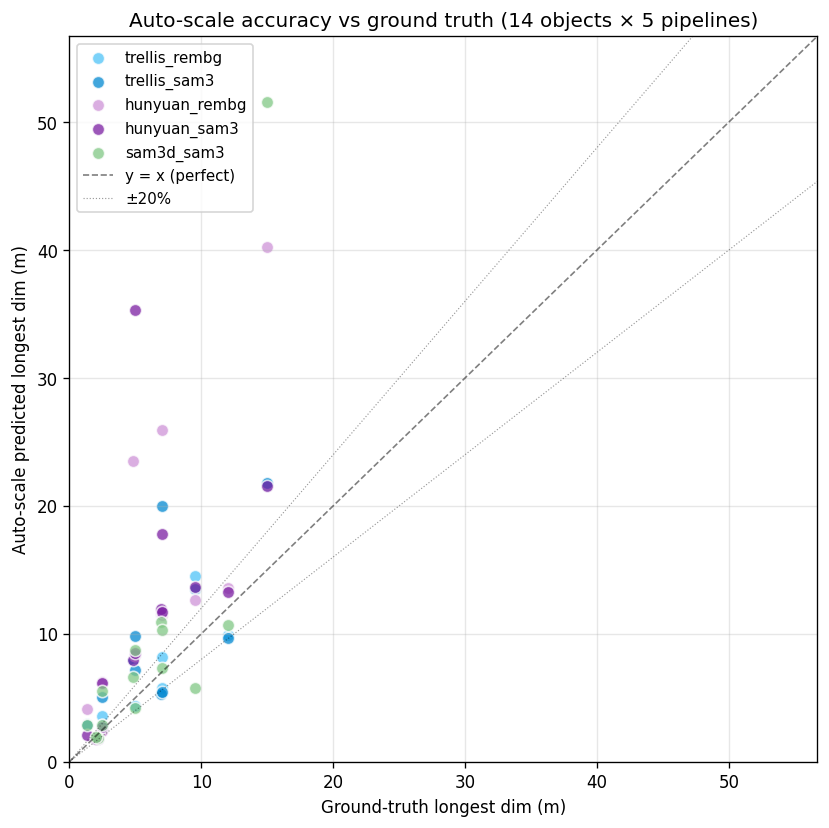
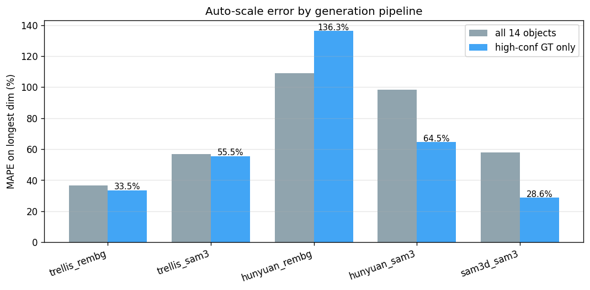
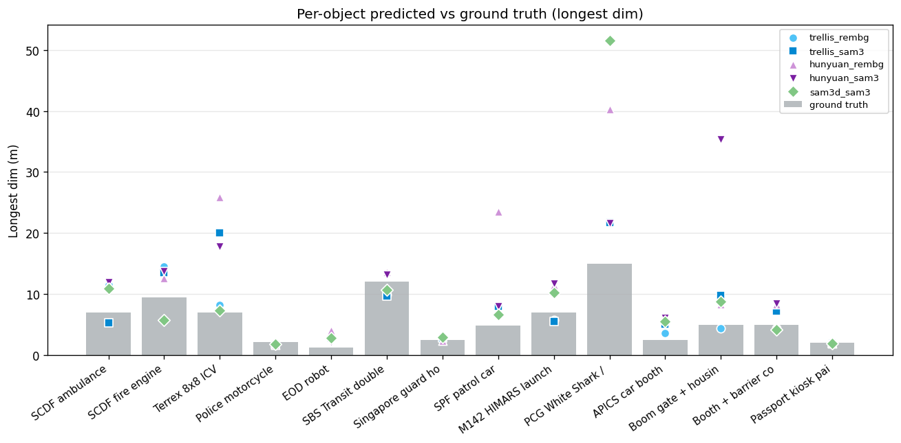

# Auto-scale benchmark — 14 HTX objects × 5 pipelines

Generated: 2026-07-12 02:51

## Headline

- **High-confidence ground truth (n=30 rows)**: longest-dim MAPE = **63.7%**, median error 29.8%, mean view-IoU 0.56
- **All ground truth (n=70 rows)**: longest-dim MAPE = 71.8%, 34% of predictions within ±20% of GT, 56% within ±50%

("high-confidence GT" = objects with manufacturer-published or standard-spec dimensions — Mercedes Sprinter, Terrex, Volvo bus, Hyundai sedan, HIMARS, standard police bike.)

## Per-pipeline accuracy

| Pipeline | n | MAPE longest (all) | MAPE longest (high-GT) | mean IoU | within ±20% | within ±50% |
|---|---:|---:|---:|---:|---:|---:|
| trellis_rembg | 14 | 36.7% | 33.5% | 0.54 | 57% | 71% |
| trellis_sam3 | 14 | 56.9% | 55.5% | 0.54 | 29% | 64% |
| hunyuan_rembg | 14 | 109.1% | 136.3% | 0.52 | 21% | 36% |
| hunyuan_sam3 | 14 | 98.4% | 64.5% | 0.52 | 21% | 43% |
| sam3d_sam3 | 14 | 57.8% | 28.6% | 0.55 | 43% | 64% |

## Per-object detail (all pipelines)

| Object | GT longest (m) | GT conf | Pipeline | Pred longest (m) | err % | IoU | conf |
|---|---:|:---:|---|---:|---:|---:|:---:|
| SCDF ambulance (Mercedes Sprinter chassis) | 6.94 | high | hunyuan_rembg | 11.57 | 66.7% | 0.57 | high |
|  |  |  | hunyuan_sam3 | 11.91 | 71.7% | 0.57 | high |
|  |  |  | sam3d_sam3 | 10.89 | 56.9% | 0.57 | high |
|  |  |  | trellis_rembg | 11.47 | 65.3% | 0.56 | high |
|  |  |  | trellis_sam3 | 5.32 | 23.4% | 0.57 | high |
| SCDF fire engine (Scania P-series pumper) | 9.50 | medium | hunyuan_rembg | 12.61 | 32.7% | 0.58 | high |
|  |  |  | hunyuan_sam3 | 13.69 | 44.1% | 0.60 | high |
|  |  |  | sam3d_sam3 | 5.74 | 39.6% | 0.60 | high |
|  |  |  | trellis_rembg | 14.50 | 52.6% | 0.57 | high |
|  |  |  | trellis_sam3 | 13.50 | 42.1% | 0.58 | high |
| Terrex 8x8 ICV | 7.00 | high | hunyuan_rembg | 25.90 | 269.9% | 0.56 | high |
|  |  |  | hunyuan_sam3 | 17.76 | 153.7% | 0.52 | high |
|  |  |  | sam3d_sam3 | 7.34 | 4.9% | 0.56 | high |
|  |  |  | trellis_rembg | 8.21 | 17.2% | 0.59 | high |
|  |  |  | trellis_sam3 | 20.00 | 185.8% | 0.53 | high |
| Police motorcycle (Yamaha/BMW class) | 2.20 | high | hunyuan_rembg | 1.75 | 20.5% | 0.40 | medium |
|  |  |  | hunyuan_sam3 | 1.75 | 20.3% | 0.40 | medium |
|  |  |  | sam3d_sam3 | 1.85 | 16.0% | 0.58 | high |
|  |  |  | trellis_rembg | 1.76 | 19.8% | 0.55 | high |
|  |  |  | trellis_sam3 | 1.79 | 18.7% | 0.55 | high |
| EOD robot (Caliber/Andros class) | 1.30 | medium | hunyuan_rembg | 4.11 | 216.3% | 0.42 | medium |
|  |  |  | hunyuan_sam3 | 2.10 | 61.7% | 0.41 | medium |
|  |  |  | sam3d_sam3 | 2.86 | 120.1% | 0.50 | high |
|  |  |  | trellis_rembg | 2.91 | 123.5% | 0.48 | medium |
|  |  |  | trellis_sam3 | 2.83 | 117.8% | 0.51 | high |
| SBS Transit double-decker (Volvo B9TL) | 12.00 | high | hunyuan_rembg | 13.59 | 13.3% | 0.62 | high |
|  |  |  | hunyuan_sam3 | 13.23 | 10.2% | 0.61 | high |
|  |  |  | sam3d_sam3 | 10.67 | 11.1% | 0.56 | high |
|  |  |  | trellis_rembg | 9.92 | 17.3% | 0.52 | high |
|  |  |  | trellis_sam3 | 9.65 | 19.5% | 0.58 | high |
| Singapore guard house | 2.50 | low | hunyuan_rembg | 2.40 | 3.9% | 0.58 | high |
|  |  |  | hunyuan_sam3 | 2.72 | 8.9% | 0.66 | high |
|  |  |  | sam3d_sam3 | 2.89 | 15.6% | 0.67 | high |
|  |  |  | trellis_rembg | 2.89 | 15.6% | 0.65 | high |
|  |  |  | trellis_sam3 | 2.86 | 14.3% | 0.65 | high |
| SPF patrol car (Hyundai i40 / sedan) | 4.85 | high | hunyuan_rembg | 23.47 | 383.9% | 0.59 | high |
|  |  |  | hunyuan_sam3 | 7.97 | 64.3% | 0.63 | high |
|  |  |  | sam3d_sam3 | 6.61 | 36.3% | 0.63 | high |
|  |  |  | trellis_rembg | 7.96 | 64.0% | 0.63 | high |
|  |  |  | trellis_sam3 | 7.95 | 63.9% | 0.63 | high |
| M142 HIMARS launcher | 7.00 | high | hunyuan_rembg | 11.44 | 63.5% | 0.52 | high |
|  |  |  | hunyuan_sam3 | 11.67 | 66.7% | 0.52 | high |
|  |  |  | sam3d_sam3 | 10.26 | 46.5% | 0.51 | high |
|  |  |  | trellis_rembg | 5.78 | 17.4% | 0.57 | high |
|  |  |  | trellis_sam3 | 5.48 | 21.7% | 0.51 | high |
| PCG White Shark / patrol craft | 15.00 | medium | hunyuan_rembg | 40.25 | 168.3% | 0.63 | high |
|  |  |  | hunyuan_sam3 | 21.58 | 43.9% | 0.66 | high |
|  |  |  | sam3d_sam3 | 51.55 | 243.7% | 0.52 | high |
|  |  |  | trellis_rembg | 21.62 | 44.2% | 0.55 | high |
|  |  |  | trellis_sam3 | 21.77 | 45.1% | 0.53 | high |
| APICS car booth | 2.50 | low | hunyuan_rembg | 6.26 | 150.6% | 0.29 | low |
|  |  |  | hunyuan_sam3 | 6.13 | 145.0% | 0.30 | medium |
|  |  |  | sam3d_sam3 | 5.56 | 122.4% | 0.28 | low |
|  |  |  | trellis_rembg | 3.59 | 43.7% | 0.34 | medium |
|  |  |  | trellis_sam3 | 5.05 | 102.1% | 0.29 | low |
| Boom gate + housing | 5.00 | low | hunyuan_rembg | 8.31 | 66.1% | 0.51 | high |
|  |  |  | hunyuan_sam3 | 35.33 | 606.7% | 0.37 | medium |
|  |  |  | sam3d_sam3 | 8.75 | 74.9% | 0.52 | high |
|  |  |  | trellis_rembg | 4.35 | 13.1% | 0.56 | high |
|  |  |  | trellis_sam3 | 9.82 | 96.5% | 0.43 | medium |
| Booth + barrier combo | 5.00 | low | hunyuan_rembg | 8.31 | 66.1% | 0.51 | high |
|  |  |  | hunyuan_sam3 | 8.49 | 69.7% | 0.48 | medium |
|  |  |  | sam3d_sam3 | 4.16 | 16.8% | 0.55 | high |
|  |  |  | trellis_rembg | 4.35 | 13.1% | 0.56 | high |
|  |  |  | trellis_sam3 | 7.18 | 43.7% | 0.56 | high |
| Passport kiosk pair | 2.00 | low | hunyuan_rembg | 1.89 | 5.3% | 0.52 | high |
|  |  |  | hunyuan_sam3 | 1.80 | 10.1% | 0.52 | high |
|  |  |  | sam3d_sam3 | 1.92 | 3.9% | 0.65 | high |
|  |  |  | trellis_rembg | 1.87 | 6.6% | 0.51 | high |
|  |  |  | trellis_sam3 | 1.97 | 1.7% | 0.67 | high |

## Figures

