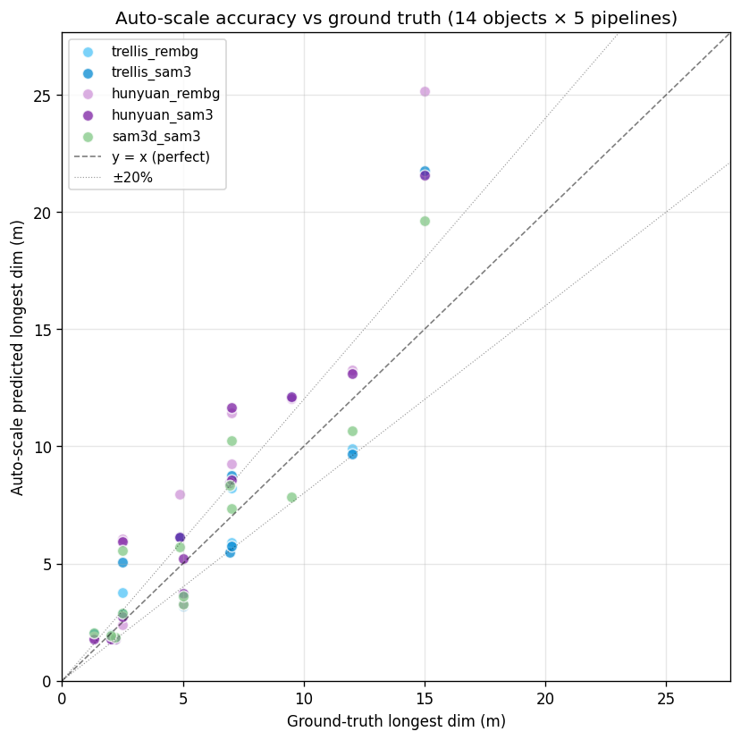
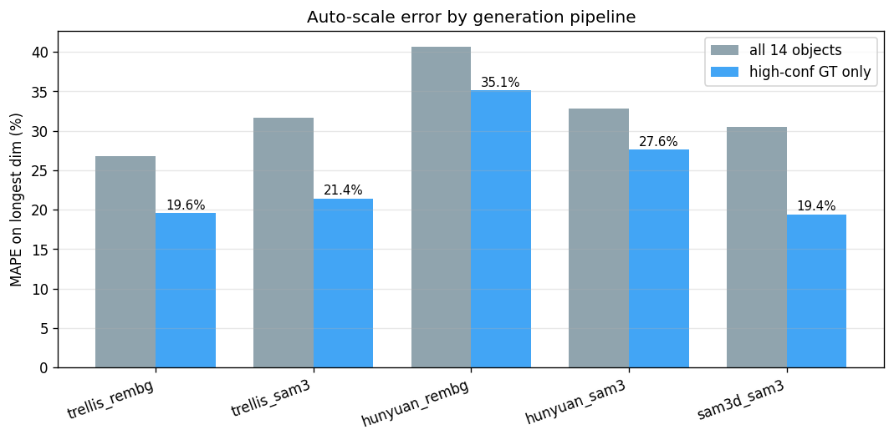
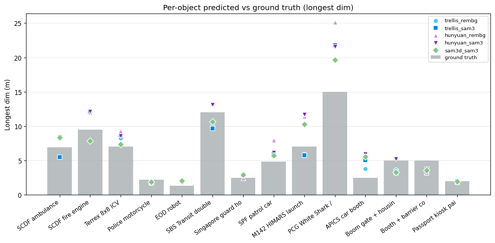

# Auto-scale benchmark — 14 HTX objects × 5 pipelines

Generated: 2026-06-06 16:53

## Headline

- **High-confidence ground truth (n=30 rows)**: longest-dim MAPE = **24.6%**, median error 19.8%, mean view-IoU 0.56
- **All ground truth (n=70 rows)**: longest-dim MAPE = 32.5%, 39% of predictions within ±20% of GT, 83% within ±50%

("high-confidence GT" = objects with manufacturer-published or standard-spec dimensions — Mercedes Sprinter, Terrex, Volvo bus, Hyundai sedan, HIMARS, standard police bike.)

## Per-pipeline accuracy

| Pipeline | n | MAPE longest (all) | MAPE longest (high-GT) | mean IoU | within ±20% | within ±50% |
|---|---:|---:|---:|---:|---:|---:|
| trellis_rembg | 14 | 26.7% | 19.6% | 0.54 | 43% | 86% |
| trellis_sam3 | 14 | 31.6% | 21.4% | 0.54 | 36% | 86% |
| hunyuan_rembg | 14 | 40.6% | 35.1% | 0.52 | 29% | 71% |
| hunyuan_sam3 | 14 | 32.8% | 27.6% | 0.52 | 36% | 86% |
| sam3d_sam3 | 14 | 30.4% | 19.4% | 0.55 | 50% | 86% |

## Per-object detail (all pipelines)

| Object | GT longest (m) | GT conf | Pipeline | Pred longest (m) | err % | IoU | conf |
|---|---:|:---:|---|---:|---:|---:|:---:|
| SCDF ambulance (Mercedes Sprinter chassis) | 6.94 | high | hunyuan_rembg | 8.42 | 21.3% | 0.57 | medium |
|  |  |  | hunyuan_sam3 | 8.45 | 21.8% | 0.57 | medium |
|  |  |  | sam3d_sam3 | 8.33 | 20.1% | 0.57 | medium |
|  |  |  | trellis_rembg | 8.40 | 21.1% | 0.56 | medium |
|  |  |  | trellis_sam3 | 5.48 | 21.1% | 0.57 | medium |
| SCDF fire engine (Scania P-series pumper) | 9.50 | medium | hunyuan_rembg | 12.04 | 26.7% | 0.58 | medium |
|  |  |  | hunyuan_sam3 | 12.11 | 27.5% | 0.60 | medium |
|  |  |  | sam3d_sam3 | 7.85 | 17.4% | 0.60 | medium |
|  |  |  | trellis_rembg | 12.17 | 28.1% | 0.57 | medium |
|  |  |  | trellis_sam3 | 12.10 | 27.4% | 0.58 | medium |
| Terrex 8x8 ICV | 7.00 | high | hunyuan_rembg | 9.26 | 32.2% | 0.56 | low |
|  |  |  | hunyuan_sam3 | 8.55 | 22.2% | 0.52 | low |
|  |  |  | sam3d_sam3 | 7.34 | 4.9% | 0.56 | high |
|  |  |  | trellis_rembg | 8.21 | 17.2% | 0.58 | high |
|  |  |  | trellis_sam3 | 8.75 | 24.9% | 0.53 | low |
| Police motorcycle (Yamaha/BMW class) | 2.20 | high | hunyuan_rembg | 1.77 | 19.3% | 0.40 | medium |
|  |  |  | hunyuan_sam3 | 1.78 | 19.2% | 0.40 | medium |
|  |  |  | sam3d_sam3 | 1.85 | 16.0% | 0.58 | high |
|  |  |  | trellis_rembg | 1.78 | 19.0% | 0.55 | medium |
|  |  |  | trellis_sam3 | 1.79 | 18.5% | 0.55 | medium |
| EOD robot (Caliber/Andros class) | 1.30 | medium | hunyuan_rembg | 1.87 | 43.8% | 0.42 | low |
|  |  |  | hunyuan_sam3 | 1.77 | 35.9% | 0.41 | medium |
|  |  |  | sam3d_sam3 | 2.06 | 58.3% | 0.50 | medium |
|  |  |  | trellis_rembg | 2.04 | 56.6% | 0.48 | medium |
|  |  |  | trellis_sam3 | 2.01 | 54.7% | 0.51 | medium |
| SBS Transit double-decker (Volvo B9TL) | 12.00 | high | hunyuan_rembg | 13.26 | 10.5% | 0.62 | medium |
|  |  |  | hunyuan_sam3 | 13.10 | 9.2% | 0.61 | medium |
|  |  |  | sam3d_sam3 | 10.67 | 11.1% | 0.56 | high |
|  |  |  | trellis_rembg | 9.92 | 17.3% | 0.52 | high |
|  |  |  | trellis_sam3 | 9.65 | 19.5% | 0.58 | high |
| Singapore guard house | 2.50 | low | hunyuan_rembg | 2.40 | 3.9% | 0.58 | high |
|  |  |  | hunyuan_sam3 | 2.72 | 8.8% | 0.66 | high |
|  |  |  | sam3d_sam3 | 2.89 | 15.4% | 0.67 | high |
|  |  |  | trellis_rembg | 2.89 | 15.6% | 0.65 | high |
|  |  |  | trellis_sam3 | 2.86 | 14.3% | 0.65 | high |
| SPF patrol car (Hyundai i40 / sedan) | 4.85 | high | hunyuan_rembg | 7.94 | 63.8% | 0.59 | low |
|  |  |  | hunyuan_sam3 | 6.14 | 26.6% | 0.63 | medium |
|  |  |  | sam3d_sam3 | 5.71 | 17.8% | 0.63 | medium |
|  |  |  | trellis_rembg | 6.16 | 27.0% | 0.63 | medium |
|  |  |  | trellis_sam3 | 6.14 | 26.5% | 0.63 | medium |
| M142 HIMARS launcher | 7.00 | high | hunyuan_rembg | 11.44 | 63.5% | 0.52 | high |
|  |  |  | hunyuan_sam3 | 11.67 | 66.7% | 0.52 | high |
|  |  |  | sam3d_sam3 | 10.26 | 46.5% | 0.51 | high |
|  |  |  | trellis_rembg | 5.90 | 15.7% | 0.57 | medium |
|  |  |  | trellis_sam3 | 5.75 | 17.8% | 0.51 | medium |
| PCG White Shark / patrol craft | 15.00 | medium | hunyuan_rembg | 25.14 | 67.6% | 0.63 | medium |
|  |  |  | hunyuan_sam3 | 21.58 | 43.9% | 0.66 | high |
|  |  |  | sam3d_sam3 | 19.62 | 30.8% | 0.52 | low |
|  |  |  | trellis_rembg | 21.62 | 44.2% | 0.55 | high |
|  |  |  | trellis_sam3 | 21.77 | 45.1% | 0.53 | high |
| APICS car booth | 2.50 | low | hunyuan_rembg | 6.03 | 141.3% | 0.29 | low |
|  |  |  | hunyuan_sam3 | 5.93 | 137.4% | 0.30 | medium |
|  |  |  | sam3d_sam3 | 5.54 | 121.6% | 0.28 | low |
|  |  |  | trellis_rembg | 3.78 | 51.1% | 0.34 | medium |
|  |  |  | trellis_sam3 | 5.05 | 102.1% | 0.29 | low |
| Boom gate + housing | 5.00 | low | hunyuan_rembg | 3.25 | 34.9% | 0.50 | low |
|  |  |  | hunyuan_sam3 | 5.22 | 4.5% | 0.37 | low |
|  |  |  | sam3d_sam3 | 3.28 | 34.3% | 0.52 | low |
|  |  |  | trellis_rembg | 3.62 | 27.5% | 0.56 | medium |
|  |  |  | trellis_sam3 | 3.36 | 32.8% | 0.43 | low |
| Booth + barrier combo | 5.00 | low | hunyuan_rembg | 3.25 | 34.9% | 0.50 | low |
|  |  |  | hunyuan_sam3 | 3.73 | 25.5% | 0.48 | medium |
|  |  |  | sam3d_sam3 | 3.60 | 28.1% | 0.55 | medium |
|  |  |  | trellis_rembg | 3.63 | 27.5% | 0.55 | medium |
|  |  |  | trellis_sam3 | 3.17 | 36.5% | 0.55 | low |
| Passport kiosk pair | 2.00 | low | hunyuan_rembg | 1.89 | 5.3% | 0.52 | high |
|  |  |  | hunyuan_sam3 | 1.80 | 10.1% | 0.52 | high |
|  |  |  | sam3d_sam3 | 1.92 | 3.9% | 0.65 | high |
|  |  |  | trellis_rembg | 1.87 | 6.6% | 0.51 | high |
|  |  |  | trellis_sam3 | 1.97 | 1.7% | 0.67 | high |

## Figures

