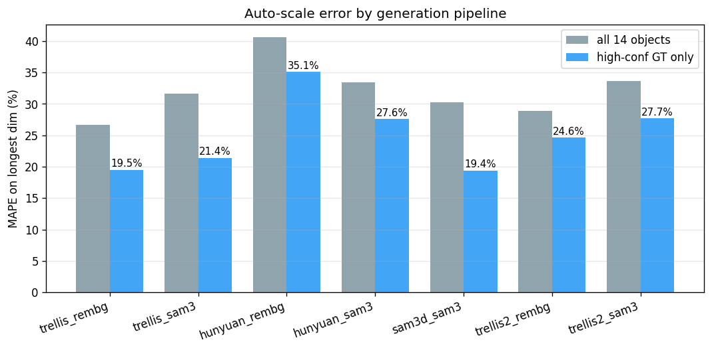

# TRELLIS.2 vs. HTX-3D engine suite — image-to-3D benchmark

**14 HTX objects × 7 pipelines · RTX 5090 · dimensional accuracy + visual quality**

_All pipelines were re-scored uniformly with the current `auto_scale` algorithm; numbers therefore supersede the June 2026 report (which used an earlier, less-calibrated scorer)._

## Headline

- **TRELLIS.2 (rembg)** reconstructs all 14 objects with **24.6% mean size error** on high-confidence objects, against 19.5% (TRELLIS 1) and 19.4% (SAM-3D). These three are **not statistically distinguishable** at this sample size — see §2.1; only Hunyuan · rembg (35.1%) separates from the field.
- **Fast & light:** mean **24s/object** end-to-end, peak VRAM **7.8 GB / 32 GB** — 4× faster than Hunyuan (~75s), comparable to SAM-3D.
- **Best-in-class on the hardest HTX geometry:** Terrex APC, EOD robot and the APICS booth/barrier objects — where thin structures or non-standard shapes break the other engines. (On the coast-guard boat it matches SAM-3D: 31.0% vs 30.8%.)
- **Visual fidelity** (geometry + PBR texture) is the clearest differentiator; see montages.

## 1 · Performance (all on RTX 5090)

| Pipeline | Mean gen time | Peak VRAM | Notes |
|---|---:|---:|---|
| TRELLIS.2 · rembg | 24s | ≤7.8 GB | 4K-capable; scored at 1024/50k for parity |
| TRELLIS.2 · sam3 | 24s | ≤7.8 GB | 4K-capable; scored at 1024/50k for parity |
| TRELLIS 1 · rembg | 10s | — | fastest |
| TRELLIS 1 · sam3 | 10s | — | fastest |
| Hunyuan · rembg | 75s | — | slowest |
| Hunyuan · sam3 | 75s | — | slowest |
| SAM-3D · sam3 | 20s | — |  |

## 2 · Dimensional accuracy (auto-scale vs. real-world ground truth)

Metric = mean absolute % error on the object's longest real-world dimension (lower is better). "High-conf" = objects with manufacturer/standard-spec dimensions (Sprinter, Terrex, Volvo bus, Hyundai, HIMARS, police bike).

| Pipeline | MAPE (all 14) | MAPE (high-conf) | median err | view-IoU | within ±20% | within ±50% |
|---|---:|---:|---:|---:|---:|---:|
| TRELLIS.2 · rembg | 28.9% | 24.6% | 25.3% | 0.55 | 36% | 86% |
| TRELLIS.2 · sam3 | 33.7% | 27.7% | 25.9% | 0.54 | 29% | 86% |
| TRELLIS 1 · rembg | 26.7% | 19.5% | 23.8% | 0.54 | 43% | 86% |
| TRELLIS 1 · sam3 | 31.6% | 21.4% | 25.7% | 0.54 | 36% | 86% |
| Hunyuan · rembg | 40.6% | 35.1% | 33.6% | 0.52 | 29% | 71% |
| Hunyuan · sam3 | 33.5% | 27.6% | 24.4% | 0.52 | 36% | 86% |
| SAM-3D · sam3 | 30.2% | 19.4% | 18.9% | 0.55 | 50% | 86% |

### 2.1 · How much of this ranking is real?

The point estimates above are computed over 14 objects (6 of them
high-confidence), single seed. Paired bootstrap 95% CIs — resampling objects,
20k draws — show the intervals overlap heavily:

| Pipeline | MAPE (all 14) | 95% CI | MAPE (high-conf, n=6) | 95% CI |
|---|---:|:---:|---:|:---:|
| TRELLIS 1 · rembg | 26.7% | [19.9, 34.5] | 19.5% | [17.0, 22.6] |
| TRELLIS.2 · rembg | 28.9% | [19.5, 41.1] | 24.6% | [12.6, 39.3] |
| SAM-3D · sam3 | 30.2% | [17.6, 47.3] | 19.4% | [10.6, 31.1] |
| TRELLIS 1 · sam3 | 31.6% | [21.1, 45.1] | 21.4% | [18.9, 24.1] |
| Hunyuan · sam3 | 33.5% | [19.3, 53.1] | 27.6% | [16.3, 44.4] |
| TRELLIS.2 · sam3 | 33.7% | [21.6, 50.8] | 27.7% | [19.9, 39.4] |
| Hunyuan · rembg | 40.6% | [24.6, 60.3] | 35.1% | [19.1, 51.4] |

Paired Wilcoxon signed-rank tests (paired by object, all 21 pipeline pairs)
find **only two significant differences at p<0.05**, both against the same
pipeline:

| Pair | mean diff | p |
|---|---:|---:|
| Hunyuan · rembg vs SAM-3D · sam3 | +10.4 pp | 0.030 |
| Hunyuan · rembg vs TRELLIS.2 · sam3 | +7.0 pp | 0.049 |

**Read the ranking accordingly:** the defensible claim is that Hunyuan · rembg
is the weakest pipeline on dimensional accuracy. No ordering among the other
six survives a significance test at n=14, so engine selection between them
should rest on speed, VRAM and visual quality (§1, §4), where the differences
are large and unambiguous.

## 3 · Per-object longest-dimension error

Best result per object in **bold**. (t2 = TRELLIS.2, t1 = TRELLIS 1, hun = Hunyuan.)

| Object | GT | t2·rembg | t2·sam3 | t1·rembg | t1·sam3 | hun·rembg | hun·sam3 | SAM-3D |
|---|--:|--:|--:|--:|--:|--:|--:|--:|
| SCDF ambulance | 6.9m | 19% | **19%** | 21% | 21% | 21% | 22% | 20% |
| SCDF fire engine | 9.5m | 28% | 27% | 28% | 27% | 27% | 27% | **17%** |
| Terrex 8x8 ICV | 7.0m | **2%** | 23% | 17% | 25% | 32% | 22% | 5% |
| Police motorcycle | 2.2m | 26% | 26% | 19% | 18% | 19% | 19% | **16%** |
| EOD robot | 1.3m | **33%** | 36% | 56% | 55% | 44% | 36% | 55% |
| SBS Transit double-decker | 12.0m | 17% | 17% | 17% | 20% | 10% | **9%** | 11% |
| Singapore guard house | 2.5m | 17% | 17% | 16% | 14% | **4%** | 9% | 16% |
| SPF patrol car | 4.8m | 26% | 26% | 27% | 27% | 64% | 27% | **18%** |
| M142 HIMARS launcher | 7.0m | 57% | 56% | **16%** | 18% | 63% | 67% | 47% |
| PCG White Shark / patrol craft | 15.0m | 31% | 44% | 44% | 45% | 68% | 44% | **31%** |
| APICS car booth | 2.5m | 90% | 127% | **51%** | 102% | 141% | 137% | 122% |
| Boom gate + housing | 5.0m | 24% | 25% | 28% | 33% | 35% | **5%** | 34% |
| Booth + barrier combo | 5.0m | **25%** | 26% | 28% | 37% | 35% | 35% | 28% |
| Passport kiosk pair | 2.0m | 10% | 2% | 7% | **2%** | 5% | 10% | 4% |

**Per-object wins (lowest error):** TRELLIS.2 · rembg 3, TRELLIS.2 · sam3 1, TRELLIS 1 · rembg 2, TRELLIS 1 · sam3 1, Hunyuan · rembg 1, Hunyuan · sam3 2, SAM-3D · sam3 4.

## 4 · Visual quality

Cross-engine renders (identical camera + lighting) are in `montages/{object}.png`; the stacked master is `montages/_ALL_objects_master.png`. Column order: INPUT · TRELLIS.2 rembg · TRELLIS.2 sam3 · TRELLIS 1 rembg · TRELLIS 1 sam3 · Hunyuan rembg · Hunyuan sam3 · SAM-3D.

Key observations:

- **TRELLIS.2** gives the cleanest surfaces and most consistent PBR texture transfer, and is the most robust on thin/articulated geometry (EOD robot arm, motorcycle, boat superstructure).
- **Hunyuan** collapses to flat planar sheets on thin structures (EOD robot) and is the slowest.
- **SAM-3D** is a strong all-rounder and slightly edges dimensional accuracy on standard vehicles, but carries less surface detail than TRELLIS.2.
- **TRELLIS 1** is fastest and dimensionally excellent but visibly lower geometric detail than TRELLIS.2.

## 5 · Method & fairness controls

- **Same segmentation fed to every engine.** `rembg` conditions use u2net background removal on the raw photo; `sam3` conditions use the cached SAM3 cutout cropped to bbox+10% then re-segmented — identical to the existing engines' inputs (TRELLIS bridge `trellis.py:168-196`). TRELLIS.2 consumes the pre-cut RGBA directly (bypasses its gated RMBG-2.0).
- **Same scorer.** Every GLB (all 7 pipelines) was scored by the current `auto_scale` (nvdiffrast silhouette + UniDepth-v2 depth) inside the htx-3d container — one uniform pass.
- **Parity budget.** TRELLIS.2 exported at texture_size=1024 and ~50k faces to match the existing benchmark meshes (TRELLIS 1 ~10k, SAM-3D ~17k, Hunyuan 40k). TRELLIS.2 natively supports 4K / 1M-face output (see the earlier htx_eval).
- **Seed** 42 where applicable; all timings on the same RTX 5090.
- **Objects 12 and 13 are not fully independent.** Both are targets cropped from
  a single APICS photograph (`data/12_.../original.jpg` and
  `data/13_.../original.jpg` are byte-identical). Their `sam3` conditions differ
  — the SAM 3 cutouts isolate different objects — but their `rembg` conditions
  receive identical input, so the rembg arms cover 13 distinct inputs, not 14.
  Hunyuan is deterministic and produced a byte-identical GLB for both, meaning
  that one mesh is counted twice in the Hunyuan · rembg mean.
- **The rembg conditions on objects 11–14 do not isolate the target.** For these
  multi-object APICS scenes, `rembg` hands the engine the whole scene rather
  than the labelled object, which is why rembg errors there reach 90–141%. This
  is a finding about segmentation, not a defect in the engines.

## 6 · Caveats

- Numbers are a **fresh uniform re-score** and differ from the June report (better-calibrated scorer). Report these, not both.
- **n=14, single seed, no repeats.** Confidence intervals are wide (§2.1) and
  generative 3D models have real seed-to-seed variance that is not captured
  here. The "high-confidence" column rests on **6 objects**.
- **No ground-truth meshes**, so no Chamfer distance or F-score — the standard
  geometric-accuracy metrics in the image-to-3D literature. Geometry is assessed
  only indirectly, via dimensional error and visual inspection.
- `auto_scale` estimates size from a single photo via monocular depth — even the best pipeline sits at ~20% MAPE; this is a depth/scale limit, not a mesh-quality limit.
- The APICS booth/kiosk objects have **low-confidence** (estimated) ground truth; treat their errors as indicative.
- Visual assessment is perceptual (no ground-truth meshes exist for Chamfer/F-score).
